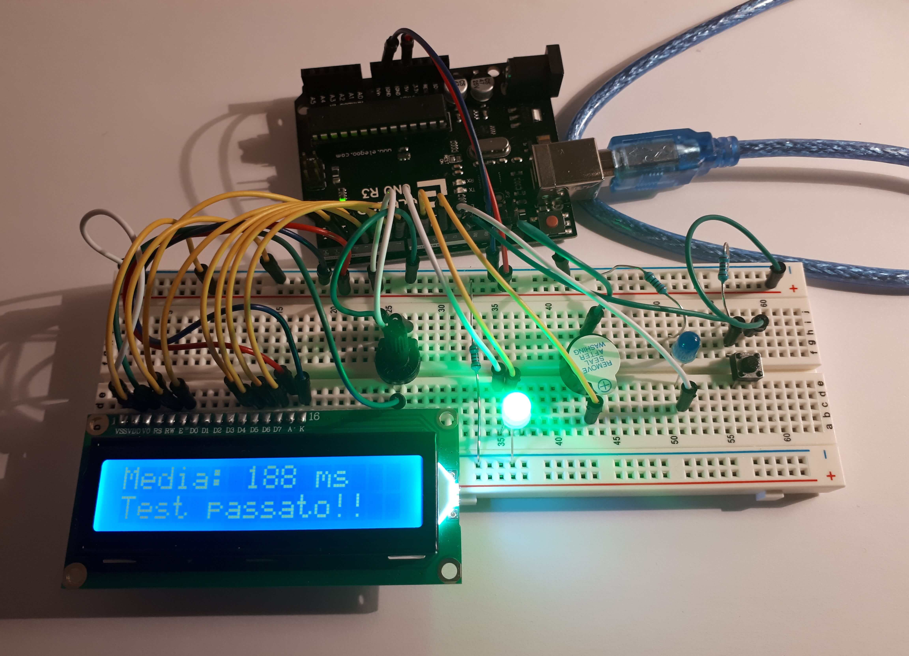

# Progetto di arduino - MISURATORE DI RIFLESSI

> [GazzolaLeonardo_A_misuratoreRiflessi](https://github.com/Gazzola-Leonardo/GazzolaLeonardo_A_misuratoreRiflessi). -->
GazzolaLeonardo_A_misuratoreRiflessi
 

Immagine della schermata principale:

## Immagine del programa in funzione:
Nell'immagine si vede il tempo in millisecondi:
- tra l'accensione del led ed il momento in cui è stato premuto il bottone.
- tra l'accensione del buzzer ed il momento in cui è stato premuto il bottone.

## Immagine di revisione:
L'immagine fa vedere:
- la media dei 2 tempi ricavati prima;
- il risultato del test (passato oppure no)

    

## Cos'è arduino?

Arduino è una piattaforma hardware composta da una serie di schede elettroniche dotate di un microcontrollore. È stata ideata e sviluppata in data 2003 da alcuni membri dell'Interaction Design Institute di Ivrea come strumento per la prototipazione rapida e per scopi hobbistici, didattici e professionali.  
_Fonte: https://it.wikipedia.org/wiki/Arduino_(hardware)_
 