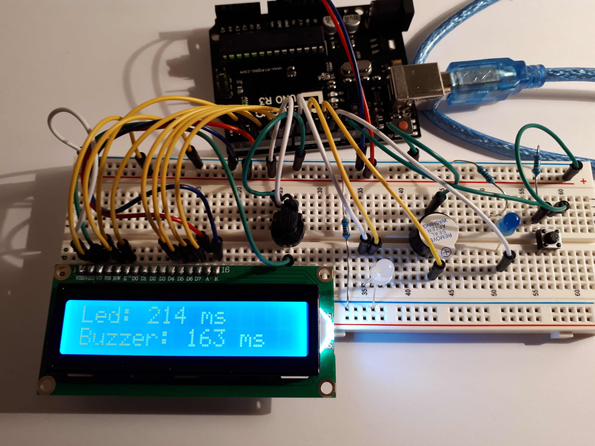

# Progetto di arduino - MISURATORE DI RIFLESSI

> [GazzolaLeonardo_A_misuratoreRiflessi](https://github.com/Gazzola-Leonardo/GazzolaLeonardo_A_misuratoreRiflessi). -->
GazzolaLeonardo_A_misuratoreRiflessi
 

Immagine della schermata principale:

## Immagine del programa in funzione:
Nell'immagine si vede il tempo in millisecondi:
- tra l'accensione del led ed il momento in cui è stato premuto il bottone.
- tra l'accensione del buzzer ed il momento in cui è stato premuto il bottone.

## Immagine di revisione:
L'immagine fa vedere:
- la media dei 2 tempi ricavati prima;
- il risultato del test (passato oppure no)

 